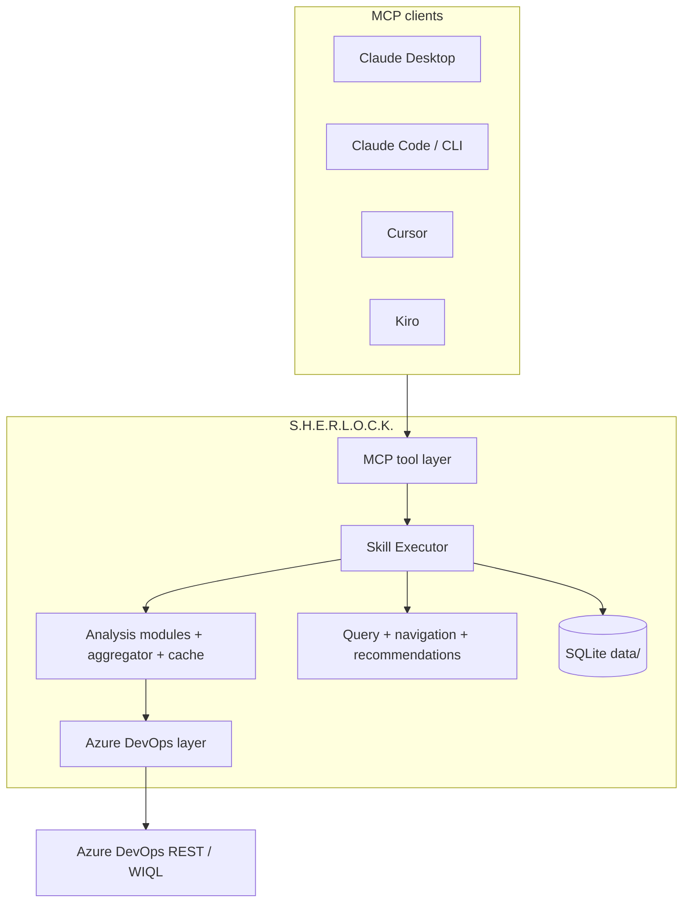

# S.H.E.R.L.O.C.K.

**Sprint Health, Execution, Risk, Logistics, Operations & Coordination Knowledge**

Local MCP server for Azure DevOps team intelligence: sprint health, workload, deadline risk, backlog quality, recommendations, custom skills, and **controlled saved-query creation**. Work items stay read-only.

This README is the map. The detailed guides live in [`docs/`](docs/README.md).

| You want to… | Open |
| --- | --- |
| Clone, Node, `.env`, PAT, first build | [docs/INSTALLATION.md](docs/INSTALLATION.md) |
| Connect **Claude Desktop, Claude Code, Claude CLI, Cursor, Kiro, Inspector** | [docs/MCP-CLIENTS.md](docs/MCP-CLIENTS.md) |
| Environment variables, team switching, query folders | [docs/CONFIGURATION.md](docs/CONFIGURATION.md) |
| Layers, diagrams, query engine, SQLite | [docs/architecture.md](docs/architecture.md) |
| Built-in skills and modes | [docs/skills.md](docs/skills.md) |
| Create / compose custom skills | [docs/custom-skills.md](docs/custom-skills.md) |
| PAT, read-only policy, what V1 will not do | [docs/SECURITY.md](docs/SECURITY.md) |
| Doctor, MCP missing, ADO errors | [docs/TROUBLESHOOTING.md](docs/TROUBLESHOOTING.md) |
| Develop and open a PR | [docs/CONTRIBUTING.md](docs/CONTRIBUTING.md) |
| What changed in V1 | [CHANGELOG.md](CHANGELOG.md) |

---

## 1. What is S.H.E.R.L.O.C.K.?

S.H.E.R.L.O.C.K. runs on your machine as `node dist/index.js`. Claude, Cursor, or Kiro start that process and call MCP tools. The server reads **your** Azure DevOps organization, project, and team from `.env`, analyses live work items, and can create saved queries under `My Queries/{ADO_TEAM}`.

It is not a website, not a hosted API, and not a work-item editor.

## 2. Key features

- Sprint, backlog, deadline, dependency, workload, and project-health analysis
- Built-in skills plus SQLite-backed custom skills (`brief` / `verbose` / `visual`)
- Work-item **read-only** security with **controlled** saved-query create/reuse
- Team-scoped queries: `ADO_TEAM=Development` → `My Queries/Development/`
- Dynamic Azure DevOps URLs from configuration (no hardcoded org/project)
- `sherlock_health_check` and `npm run doctor`
- Redacted logs and tool responses (PAT never printed)

## 3. Architecture



```text
Claude / Cursor / Kiro
        ↓
       MCP (stdio)
        ↓
MCP Tool Layer
        ↓
Skill Executor
        ↓
Analysis Module Registry
        ↓
Data Aggregator + Cache
        ↓
Azure DevOps Layer
        ↓
Azure DevOps REST API / WIQL
        + My Queries/{ADO_TEAM}
```

Full diagrams and component notes: [docs/architecture.md](docs/architecture.md).

## 4. Requirements

- Node.js **≥ 22.5.0**
- npm
- Git
- An Azure DevOps organization, project, and team
- A PAT (read; plus query write if you want saved queries)

## 5. Installation

Short path (every step is expanded in [docs/INSTALLATION.md](docs/INSTALLATION.md)):

```bash
git clone <your-repo-url> sherlock
cd sherlock
npm install
cp .env.example .env
```

Windows PowerShell: `Copy-Item .env.example .env`

Edit `.env` with **your** org, project, team, and PAT. Then:

```bash
npm run doctor
npm run build
npm test
```

Then connect a client: [docs/MCP-CLIENTS.md](docs/MCP-CLIENTS.md).

## 6. Configuration

```env
ADO_ORGANIZATION=your_organization
ADO_PROJECT=your_project
ADO_TEAM=your_team
ADO_PAT=your_personal_access_token
SHERLOCK_ENV=development
LOG_LEVEL=info
TOKEN_DEBUG=false
```

Required values are validated at startup. Examples in `.env.example` (`KEBS4KAAR` / `K4K` / `Platform`) are samples only.

Team isolation of saved queries is documented in [docs/CONFIGURATION.md](docs/CONFIGURATION.md).

## 7. Azure DevOps PAT

Create a PAT in Azure DevOps → User settings → Personal access tokens.

Minimum for analysis: **Work Items (Read)** and **Project and Team (Read)**. Saved queries need permission to create queries under **My Queries**.

Never commit `.env`. Never put the PAT in README, issues, or query titles. Health check reports “PAT configured”, not the secret. Details: [docs/SECURITY.md](docs/SECURITY.md).

## 8. Running the MCP

```bash
npm run build
npm run start
```

`npm run start` waits on stdin (stdio). MCP clients start this process for you; you usually do not leave `start` running yourself.

| Script | Purpose |
| --- | --- |
| `npm run build` | Compile TypeScript → `dist/index.js` |
| `npm run start` | Run the compiled MCP server |
| `npm run doctor` | Installation / config / ADO diagnostics |
| `npm test` | Unit tests (mocked ADO) |
| `npm run inspector` | MCP Inspector |

## 9–13. MCP clients (summary)

Full copy-paste configs, file paths, restart rules, and verification prompts:

**[docs/MCP-CLIENTS.md](docs/MCP-CLIENTS.md)**

| Client | Config | Add server |
| --- | --- | --- |
| **Claude Desktop** | `claude_desktop_config.json` | Settings → Developer → Edit Config |
| **Claude Code** | `.mcp.json` or `~/.claude.json` | `claude mcp add --transport stdio …` |
| **Claude CLI** | same as Claude Code | `claude mcp add` then `claude` / `/mcp` |
| **Cursor** | `.cursor/mcp.json` or `~/.cursor/mcp.json` | Settings → Tools & MCP |
| **Kiro** | `.kiro/settings/mcp.json` | Command Palette → Open MCP config |
| **Inspector** | `mcp-inspector.config.json` | `npm run inspector` |

Shared JSON shape (replace the path):

```json
{
  "mcpServers": {
    "sherlock": {
      "command": "node",
      "args": ["/absolute/path/to/sherlock/dist/index.js"]
    }
  }
}
```

Windows: use `C:\\Users\\you\\src\\sherlock\\dist\\index.js` (escaped backslashes) or forward slashes. Prefer an absolute path to `node.exe` if the GUI cannot see `node` on PATH.

## 14. Available skills

Standup, morning brief, sprint health, project health, workload, deadlines, dependencies, backlog quality, stale work, delivery forecast, weekly review, assignment recommendations, and more.

Modes: `brief`, `verbose`, `visual`.

Catalogue: [docs/skills.md](docs/skills.md) and [skills/README.md](skills/README.md).

## 15. Custom skills

Preview → confirm → save → execute. Compose existing skills into one module-union skill. Persist in SQLite.

[docs/custom-skills.md](docs/custom-skills.md)

## 16. Security model

S.H.E.R.L.O.C.K. v1 does **not** create, update, delete, assign, or field-edit work items.

It **can** read ADO, run WIQL, create/reuse saved queries under `My Queries/{ADO_TEAM}`, analyse, recommend, and manage local custom skills.

[docs/SECURITY.md](docs/SECURITY.md)

## 17. Troubleshooting

```bash
npm run doctor
```

Then [docs/TROUBLESHOOTING.md](docs/TROUBLESHOOTING.md).

## 18. Development

```bash
npm run build
npx vitest run
```

Live ADO checks are opt-in (`npm run verify:live`) and **not** required for public CI. [docs/CONTRIBUTING.md](docs/CONTRIBUTING.md)

## 19. Roadmap

V1: Azure DevOps + team/sprint intelligence + read-only work items + controlled queries + custom skills + MCP.

Possible V2 (not implemented): email, extra platform adapters, scheduling.

## 20. License

No `LICENSE` file is in this repository yet. A license decision is required before public distribution. Do not assume MIT or proprietary terms.
