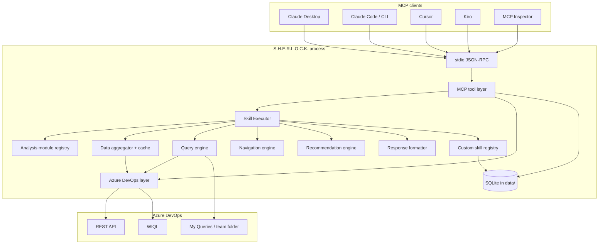

# Architecture

S.H.E.R.L.O.C.K. is an MCP-first Azure DevOps intelligence server. It does **not** include a web UI, scheduler, or email stack in V1.

This document describes the **current** architecture. It is not a proposal to redesign SkillExecutor or the analysis pipeline.

## System context



ASCII equivalent:

```text
Claude Desktop / Claude Code / Claude CLI / Cursor / Kiro / Inspector
        |
        |  stdio MCP (JSON-RPC)
        v
+------------------------------------------------------+
| MCP tool layer                                       |
|  ado_*  analysis_*  skill_*  sherlock_*  |
+-----------------------------+------------------------+
                              |
                              v
                    Skill Executor
                              |
          +-------------------+-------------------+
          |                   |                   |
          v                   v                   v
 Analysis modules     Data aggregator      Custom skill
      registry             + cache            registry
          |                   |                   |
          v                   v                   v
 Recommendation        Query engine          SQLite
      engine           Navigation engine     (data/)
          |                   |
          v                   v
     Response formatter   Azure DevOps layer
                              |
                              v
              Azure DevOps REST API / WIQL
              Saved queries: My Queries/{ADO_TEAM}
```

## Layers

### 1. MCP clients

Clients spawn `node dist/index.js` and speak MCP over stdin/stdout. They do not call Azure DevOps themselves.

Setup: [MCP-CLIENTS.md](MCP-CLIENTS.md).

### 2. MCP tool layer (`src/mcp/`)

Thin orchestrators registered in `src/server.ts`. Groups:

| Prefix | Role |
| --- | --- |
| `ado_*` | Measured Azure DevOps reads |
| `analysis_*` | Heuristic envelopes: `facts` vs `observations` / `concerns` / `recommendations` |
| `tl_*` | Local audit-trail reviews |
| `skill_*` | List / get / execute built-in and custom skills |
| `sherlock_*` (custom skills) | Custom skill lifecycle and composition |
| `create_ado_query` | **Only** Azure DevOps write: saved queries |
| `sherlock_health_check` | Configuration + ADO + runtime diagnostics |

Tools are audited at startup against the read-only policy (`src/security/read-only-policy.ts`). The only non-read-only tool allowed is `create_ado_query`.

### 3. Core (`src/core/`)

| Component | Responsibility |
| --- | --- |
| SkillExecutor | Runs a `SkillDefinition` in brief / verbose / visual |
| AnalysisModuleRegistry | Named analysis modules (workload, sprint, deadline, …) |
| DataAggregator | Shared ADO snapshot for one execution; avoids duplicate REST calls |
| CacheManager | Short-lived metadata cache |
| QueryEngine | Build WIQL; reuse or create team-scoped saved queries |
| NavigationEngine | URLs from `ADO_ORGANIZATION` / `ADO_PROJECT` / team |
| RecommendationEngine | Advisory actions; never mutates work items |
| ResponseFormatter | Mode-specific layout |
| ContextManager | Request context from centralized config |
| Skill composer / registry | Custom skills in SQLite; compose = module union snapshot |

SkillExecutor is the orchestration engine. V1 productization does not rewrite it.

### 4. Azure DevOps layer (`src/azure-devops/`)

| Type | Role |
| --- | --- |
| Read client | GET + allowlisted WIQL POST only |
| Write client | Saved-query folder ensure + query create |
| WorkItemService / TeamService / SprintService / ProjectService | Domain reads |
| WIQL builder | Structured filters → SELECT-only WIQL |
| Field mapping / profiles | Compact DTOs to control token size |

URLs are always:

```text
https://dev.azure.com/{organization}/{project}/...
```

Organization, project, and team come from `src/config/env.ts` (`config.ado.*`). They are not hardcoded.

### 5. Persistence (`src/database/`)

SQLite file default: `data/sherlock.sqlite` (`DATABASE_URL`).

Stored:

- `tl_activity` — tool audit summaries (redacted)
- `custom_skills` — custom skill JSON

Not stored:

- PAT
- Authorization headers
- Raw credential-shaped values (redaction pipeline)

`data/` is gitignored. The database is created on startup.

## Query engine and team isolation

Saved queries are **not** stored under a global S.H.E.R.L.O.C.K. folder.

```text
My Queries/
  ├── {ADO_TEAM = Platform}/
  │     └── Open Active Work
  ├── {ADO_TEAM = Development}/
  │     └── Open Active Work
  └── {ADO_TEAM = QA}/
        └── Open Active Work
```

Reuse is scoped to organization + project + team folder + query identity. A Platform query is never the canonical query for Development.

Legacy folders such as `My Queries/KaarFlow` are **not** deleted or migrated automatically.

See [CONFIGURATION.md](CONFIGURATION.md) and [query-engine.md](query-engine.md).

## Security boundary

```text
  MCP client
      |
      |  no PAT in tool schemas
      v
  Tool registry + redaction + audit
      |
      +-- work-item writes: forbidden
      +-- WIQL POST: allowlisted, SELECT-only
      +-- saved query create/reuse: permitted, team folder
      |
      v
  Azure DevOps with PAT in process memory only
```

Narrative: [SECURITY.md](SECURITY.md).

## Token optimization

- Field profiles strip unused work-item fields.
- DataAggregator shares one fetch set across modules in a skill run.
- Count **> 3** categories become a saved-query link instead of dumping items.
- `brief` mode caps findings and recommendations.
- `TOKEN_DEBUG=true` logs telemetry counts, never the PAT.

## Configuration flow

```text
.env  ──►  loadDotEnv()  ──►  getConfig()
                                  │
                                  ├── config.ado.organization
                                  ├── config.ado.project
                                  ├── config.ado.team
                                  ├── config.ado.pat   (never logged)
                                  └── config.database.path
```

Missing required env fails startup with an actionable message. PAT is never printed.

## Skills

```text
skills/<name>/SKILL.md     built-in markdown playbooks
InternalSkillRegistry      executable SkillDefinition for skill_execute
SQLite custom_skills       user-created / composed skills
```

Built-in skills cannot be edited, disabled, or deleted. They can be duplicated into a custom skill.

Details: [SKILLS.md](SKILLS.md), [CUSTOM-SKILLS.md](CUSTOM-SKILLS.md).

## Runtime entry

`src/index.ts` → `buildServer()` → `StdioServerTransport`.

Package scripts:

| Script | Purpose |
| --- | --- |
| `npm run build` | `tsc` → `dist/` |
| `npm run start` | `node dist/index.js` |
| `npm run doctor` | Install/config/ADO diagnostics |
| `npm run inspector` | MCP Inspector |
| `npm test` | Vitest (mocked ADO) |

## What V1 explicitly is not

- No frontend
- No scheduler
- No email / Microsoft Graph
- No work-item create/update/delete/assign
- No GitHub/GitLab adapters (naming is adapter-ready only)
